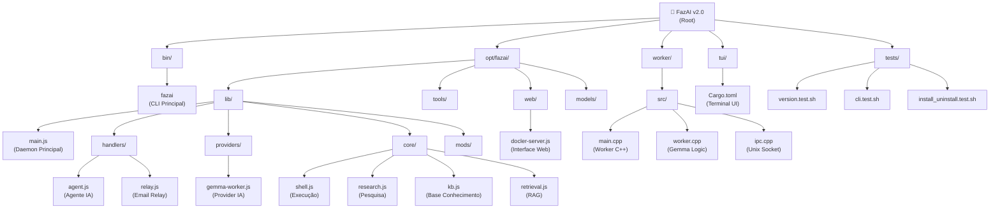

# FazAI v2.0 - Orquestrador Inteligente de Automação

## Change Log (Changelog)
- **2025-08-25**: **Interface OPNsense Avançada Implementada** 
  - 🛡️ **Editor Visual de Regras de Firewall**: Interface gráfica para criar/editar regras com validação em tempo real
  - 📊 **Dashboard de Métricas Tempo Real**: Painéis de CPU, memória, uptime, e tráfego de rede com atualização automática (15s)
  - 💻 **Terminal OPNsense MCP**: Interface de linha de comando direta com protocolo MCP para comandos avançados
  - 💾 **Backup & Restore**: Funcionalidades integradas de backup de configuração e aplicação de mudanças
  - 🔧 **APIs Completas**: Todas as rotas OPNsense expostas no DOCLER (/api/opn/*) com proxy transparente
  - ⚡ **UX Aprimorada**: Emojis, formatação visual, e feedback interativo para todas as operações
- **2025-08-25**: **Integração WebUIs Unificada** 
  - ✅ Corrigido problema do serviço DOCLER (permissões fazai-web, portas 3220/3221)
  - 🌟 **GPT-Web2Shell integrado**: Bridge transcendental para Mia executar comandos via chat OpenAI/Claude
  - 🎯 **Dashboard Unificado**: Painel centralizado mostrando status de todos os serviços (FazAI Main, DOCLER, GPT-Web2Shell, Qdrant, Gemma Worker)
  - 🧠 **Qdrant Vector DB**: Base de conhecimento vetorial com interface web ativa (porta 6333)
  - 📊 **Monitoramento em Tempo Real**: Auto-refresh de status dos serviços a cada 30s
  - 🔧 **Consolidado no Instalador**: Todas as mudanças incorporadas no install.sh com detecção Docker/binário nativo
- **2025-08-24**: Inicialização da arquitetura com Claude Code - Estrutura modular documentada, diagrama Mermaid criado, breadcrumbs de navegação implementados

## Visão do Projeto

FazAI v2.0 é um sistema orquestrador inteligente de IA que evoluiu de um simples orquestrador para um agente de IA cognitivo com raciocínio persistente. Combina IA local (modelo Gemma) com automação de sistema, monitoramento de segurança e integrações empresariais.

## Visão Geral da Arquitetura

O sistema consiste em três camadas principais:
1. **Camada CLI**: `/bin/fazai` - Interface de linha de comando
2. **Camada Daemon**: `/opt/fazai/lib/main.js` - Servidor Node.js Express (porta 3120)
3. **Camada Worker**: `/worker/` - Worker C++ Gemma para inferência de IA

### Componentes-Chave
- **Sistema de Agentes**: Raciocínio persistente com 9 tipos de ação (plan, ask, research, shell, toolSpec, observe, commitKB, done)
- **Processo Worker**: Binário C++ usando libgemma.a para inferência de IA de baixa latência
- **Base de Conhecimento**: Integração Qdrant para RAG (Retrieval-Augmented Generation)
- **Integrações Empresariais**: Firewalls OPNsense, SpamExperts, Cloudflare, email relay
- **Ferramentas de Segurança**: Integração ModSecurity, Suricata, CrowdSec

## Diagrama da Estrutura de Módulos



## Índice de Módulos

| Módulo | Caminho | Linguagem | Responsabilidade | Status |
|--------|---------|-----------|------------------|--------|
| **CLI Principal** | `bin/fazai` | Node.js | Interface de linha de comando | ✅ Ativo |
| **Daemon Core** | `opt/fazai/lib/main.js` | Node.js | Orquestração principal e API REST | ✅ Ativo |
| **Agent Handlers** | `opt/fazai/lib/handlers/` | Node.js | Handlers de agente inteligente e relay | ✅ Ativo |
| **AI Providers** | `opt/fazai/lib/providers/` | Node.js | Provedores de IA (Gemma worker) | ✅ Ativo |
| **Core Functions** | `opt/fazai/lib/core/` | Node.js | Shell, pesquisa, KB, retrieval | ✅ Ativo |
| **System Tools** | `opt/fazai/tools/` | Node.js/Bash | Ferramentas utilitárias e configuração | ✅ Ativo |
| **Web Interface** | `opt/fazai/web/` | Node.js/HTML | Interface web DOCLER com WebSocket | ✅ Ativo |
| **Gemma Worker** | `worker/` | C++ | Worker para processamento Gemma | ✅ Ativo |
| **Terminal UI** | `tui/` | Rust | Interface de usuário terminal | 🔄 Em desenvolvimento |
| **Test Suite** | `tests/` | Bash/PowerShell | Testes automatizados | ✅ Ativo |

## Execução e Desenvolvimento

### Instalação e Setup
```bash
# Instalar FazAI
sudo ./install.sh --clean

# Instalar com suporte llama.cpp
sudo ./install.sh --with-llama

# Instalar ferramentas de desenvolvimento
bash dev/install_dev_tools.sh
```

### Construção de Componentes

#### Worker C++
```bash
cd worker/
./build.sh
# Ou manualmente:
mkdir -p build && cd build
cmake .. -DCMAKE_BUILD_TYPE=Release
make -j$(nproc)
sudo make install
```

#### Módulos Nativos
```bash
cd opt/fazai/lib/mods/
./build.sh
# Ou módulo individual:
gcc -shared -fPIC -o system_mod.so system_mod.c
```

### Gerenciamento de Serviços
```bash
# Serviço principal
sudo systemctl start/stop/restart fazai
sudo systemctl status fazai

# Worker service
sudo systemctl start/stop/restart fazai-gemma-worker

# Interface web
sudo systemctl start/stop/restart fazai-docler
```

### Ferramentas de Desenvolvimento
```bash
# TUI de configuração
npm run config-tui
# ou: bash opt/fazai/tools/fazai-config-tui.sh

# Interface web
npm run web
# ou: bash opt/fazai/tools/fazai_web.sh

# Terminal UI
npm run tui
# ou: bash opt/fazai/tools/fazai-tui.sh
```

## Estratégia de Testes

### Testes Automatizados
```bash
# Executar todos os testes
npm test

# Suítes de teste individuais
bash tests/version.test.sh          # Teste de versão
bash tests/cli.test.sh              # Teste da CLI
bash tests/install_uninstall.test.sh # Teste de instalação

# Testes específicos de componentes
bash opt/fazai/tools/fazai_smoke.sh
node opt/fazai/tools/test_complex_tasks.js
```

### Cobertura de Testes
- **Unitários**: Módulos core e handlers
- **Integração**: Worker C++ com daemon Node.js
- **Sistema**: CLI e fluxos end-to-end
- **Smoke Tests**: Verificação rápida de funcionalidades

## Padrões de Codificação

### Arquitetura
- **Modular**: Separação clara de responsabilidades
- **Event-Driven**: Comunicação baseada em eventos
- **Microserviços**: Componentes independentes comunicando via IPC

### Linguagens e Padrões
- **Node.js**: ESM modules, async/await, error handling
- **C++**: C++17, RAII, exception safety
- **Rust**: Safe concurrency, error propagation
- **Documentação**: JSDoc para Node.js, Doxygen para C++

### IPC e Comunicação
- **Unix Sockets**: Worker C++ ↔ Daemon Node.js
- **HTTP REST**: API externa
- **WebSocket**: Interface web em tempo real
- **ND-JSON**: Protocolo estruturado para ações de IA

## Diretrizes de Uso da IA

### Sistema de Agentes
O FazAI utiliza um sistema de agentes com 9 tipos de ação estruturada:
- `plan`: Criar plano de execução
- `ask`: Solicitar entrada do usuário
- `research`: Coletar informações
- `shell`: Executar comandos do sistema
- `toolSpec`: Geração dinâmica de ferramentas
- `observe`: Monitorar estado do sistema
- `commitKB`: Armazenar na base de conhecimento
- `done`: Completar tarefa

### Provedores de IA
1. **Local (Primário)**: Gemma 2.0-2B via worker C++
2. **Fallback**: OpenRouter, OpenAI, Anthropic, Google Gemini, Ollama

### Configuração
- **fazai.conf**: Configuração principal com provedores de IA, telemetria, configurações OPNsense
- **fazai.service**: Definição de serviço systemd
- **package.json**: Dependências Node.js e scripts
- **CMakeLists.txt**: Configuração de build do worker C++

## Notas Importantes

- **Módulos Nativos**: Requerem `ffi-napi-v22` para bindings FFI Node.js
- **Arquivos de Modelo**: Modelo Gemma deve estar em `/opt/fazai/models/gemma/`
- **Comunicação por Socket**: Worker usa sockets Unix para IPC
- **Permissões**: Daemon principal executa como root, interface web como usuário `fazai-web`
- **Logs**: Log principal em `/var/log/fazai/fazai.log`
- **Telemetria**: Endpoints opcionais para métricas Prometheus e ingestão de logs

### Dependências de Build
**Requisitos do Sistema**:
- Node.js 22.x+
- Python 3.10+
- CMake 3.16+
- GCC/G++ ou Clang
- Build tools (make, build-essential)

**Dependências Opcionais**:
- Docker (para Qdrant e deployment containerizado)
- Rust/Cargo (para interface TUI)
- libcurl-dev (para recursos HTTP)