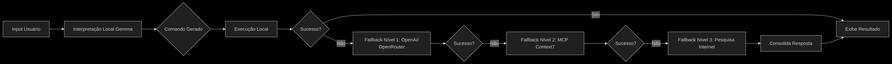

# FazAI • Orquestrador Inteligente & Ops Console



O FazAI combina um **agente inteligente baseado em Gemma**, memória vetorial persistente e um **console operacional web** para administrar infraestrutura, segurança e integrações corporativas. O fluxo acima resume o ciclo completo: receber objetivos em linguagem natural, planejar, executar ferramentas (internas ou externas), observar resultados, aprender e registrar conhecimento.

- **Worker Gemma** em Python/C++ (PyBind + libgemma) com sessões persistentes e geração em streaming.
  - **Novo**: Integração Gemma3.cpp - veja [GEMMA_QUICKSTART.md](GEMMA_QUICKSTART.md) para setup rápido
- **Dispatcher Inteligente** que roteia requisições entre provedores locais/remotos (Gemma, OpenAI, Context7, MCP, RAG).
- **Console Ops Web** (Node + Express) com painéis de monitoramento, RAG, integrações Cloudflare/OPNsense, Docker, logs e notas.
- **Base de Conhecimento (Qdrant)** para memória de longo prazo (coleções `fazai_memory`, `fazai_kb`).

> **Licença:** Creative Commons Attribution 4.0 (CC BY 4.0)

---

## Sumário
1. [Arquitetura](#arquitetura)
2. [Recursos Principais](#recursos-principais)
3. [Instalação](#instalação)
   - [Pré-requisitos](#pré-requisitos)
   - [Instalação via script](#instalação-via-script)
   - [Contêiner Docker (minimal e full)](#contêiner-docker)
   - [Pós-instalação](#pós-instalação)
   - [Gemma3 Integration](#gemma3-integration) 🆕
4. [Console Web](#console-web)
5. [Integrações Cloudflare & OPNsense](#cloudflare--opnsense)
6. [RAG & Memória Vetorial](#rag--memória-vetorial)
7. [CLI FazAI & Serviços](#cli-fazai--serviços)
8. [Desenvolvimento](#desenvolvimento)
9. [Solução de Problemas](#solução-de-problemas)
10. [Licença](#licença)

---

## Arquitetura

| Camada | Descrição |
| --- | --- |
| **Agente / Dispatcher** | `opt/fazai/lib/main.js` gerencia filas, roteamento e fallback entre provedores. Trabalha com ações ND-JSON (`plan`, `toolSpec`, `observe`, `done`, etc.). |
| **Gemma Worker** | `worker/bin/fazai-gemma-worker.py` (Python) + `libgemma.so` (C++). Socket UNIX padrão `/run/fazai/gemma.sock`. Timeouts, cancelamento e métricas configuráveis. |
| **Ops Backend** | `opt/fazai/web/hp-console/server.js` (Express). Expõe APIs REST/SSE para operações (rede, Docker, logs), ingestão RAG, Cloudflare, OPNsense, SMTP, etc. |
| **Ops Frontend** | `opt/fazai/web/hp-console/desktop.js` (SPA em estilo desktop). Carrega componentes de monitoramento, integrações, notas, catálogo RAG e gerenciador Docker. |
| **Memória & Dados** | Qdrant (`fazai_memory`, `fazai_kb`), Qdrant UI opcional, arquivos JSON locais (`data/settings.json`, `data/cloudflare_accounts.json`, `data/opnsense_servers.json`). |

---

## Recursos Principais

- **Planejamento inteligente** com Gemma + fallback (OpenAI, Context7, web search) e rastreamento via ND-JSON.
- **Console web** com dezenas de ferramentas integradas, incluindo:
  - Monitoramento ativo (ping/HTTP/porta/SNMP) com alertas e logs em `/data/alerts.log`.
  - Gerenciamento de Docker com métricas locais (CPU/RAM/Rede/IO) e histórico sparkline.
  - Painéis para SMTP, Telegram, Instagram, Twilio, Qdrant, RAG, logs do sistema e notas rápidas.
- **RAG completo**: ingestão de PDFs/DOC/JSON/Texto, embeddings locais (feature hashing 384d) e consultas semânticas contra Qdrant.
- **Cloudflare**: cadastro de contas (API token), gestão de zonas e registros DNS, convites de usuários, túneis Zero Trust, auditoria de logs, histórico local.
- **OPNsense**: inventário de appliances, chamadas REST pré-configuradas (usuários, OpenVPN, firewall, pacotes, interfaces, rotas, logs), execuções ad-hoc.
- **Instalador idempotente** (`install.sh`) que provisiona dependências (Python, Node, poppler, pandoc, docx2txt, lynx, w3m, jq), copia assets do console e prepara systemd.

---

## Instalação

### Pré-requisitos
- Distribuição baseada em Debian/Ubuntu com privilégios de `root`.
- 6 GB de RAM recomendados para operar Gemma 2B.
- Porta padrão: `3120` (API FazAI). Socket Gemma: `/run/fazai/gemma.sock`.
- Para RAG: Qdrant ≥ 1.7 com coleções `fazai_memory` e `fazai_kb` (vector size 384).

### Instalação via script
```bash
# 1. Clonar o repositório
sudo git clone https://github.com/rluf/fazai.git /opt/fazai-src
cd /opt/fazai-src

# 2. Executar instalador (requer sudo/root)
sudo ./install.sh

# 3. (Opcional) Reiniciar serviço worker
sudo systemctl restart fazai-gemma-worker
```
O instalador:
1. Instala Python 3, pip, Node.js 22, poppler-utils, pandoc, docx2txt, lynx, w3m, jq.
2. Executa `npm install` no diretório root.
3. Copia binários/scripts para `/opt/fazai` e configura `/etc/fazai/fazai.conf`.
4. Recria assets do console (incluindo `assets/rag-viewer`).
5. Provisiona o serviço `fazai-gemma-worker.service` via systemd.

> **Configuração**: após a instalação, edite `/etc/fazai/fazai.conf`. Há seções para dispatcher, Qdrant, RAG (`default_collection`), Cloudflare e OPNsense (paths de storage JSON).

### Contêiner Docker

#### 1. Imagem minimal (Dockerfile padrão)
Adequada quando o host já provê pesos Gemma e dependências externas (Qdrant, etc.).
```bash
docker build -t fazai-minimal .
docker run -d --name fazai \
  -p 3120:3120 \
  -v /etc/fazai:/etc/fazai \
  -v /var/log/fazai:/var/log/fazai \
  fazai-minimal
```

#### 2. Imagem completa (`Dockerfile.full`)
Provisiona dependências extras (poppler, pandoc, docx2txt, lynx, w3m, jq) e compila o worker no contêiner.
```bash
docker build -f Dockerfile.full -t fazai-full .
docker run -d --name fazai-full \
  -p 3120:3120 \
  -v fazai_conf:/etc/fazai \
  -v fazai_logs:/var/log/fazai \
  -v fazai_data:/opt/fazai/web/hp-console/data \
  fazai-full
```
Pesos Gemma devem ser montados em `/opt/fazai/models/gemma`. Ajuste `FAZAI_GEMMA_MODEL` via variável de ambiente se necessário.

### Gemma3 Integration

FazAI agora suporta integração nativa com Google Gemma3.cpp para inferência local de alta performance.

**Setup Rápido:**
```bash
cd worker
./setup_gemma.sh  # Baixa e compila gemma.cpp automaticamente
./build.sh        # Compila worker com suporte Gemma
```

**Download de Modelos:**
- Kaggle: https://www.kaggle.com/models/google/gemma
- Modelos recomendados: gemma-2b-it (4GB), gemma-7b-it (14GB), gemma3-1b-it (2GB)

**Documentação Completa:**
- [Guia Rápido](GEMMA_QUICKSTART.md) - TL;DR e comandos essenciais
- [Guia Completo](worker/GEMMA_INTEGRATION.md) - Integração detalhada, troubleshooting, otimizações
- [Worker README](worker/README.md) - Arquitetura e desenvolvimento

**Modos de Build:**
- Com Gemma nativo (recomendado)
- Com biblioteca pré-compilada
- Modo stub (desenvolvimento/testes)

### Pós-instalação
1. **Verificar serviço**:
   ```bash
   systemctl status fazai-gemma-worker
   journalctl -u fazai-gemma-worker -f
   ```
2. **Testar API**:
   ```bash
   curl http://localhost:3120/health
   fazai agent "diga olá"
   ```
3. **Acessar o console**: abra `http://seu-host:5050/` e limpe o cache (`localStorage.removeItem('fazai-ops-desktop-v1')`) caso a UI anterior apareça.

---

## Console Web
Principais módulos (arquivo `opt/fazai/web/hp-console/desktop.js`):
- **Monitoramento**: cadastre hosts, defina modo (ping/http/porta/snmp), receba alertas (`/api/alerts/notify`) e acompanhe logs (`data/alerts.log`).
- **Docker Manager**: métricas locais (CPU, Memória, Rede, IO) + ações Start/Stop/Restart/Logs.
- **RAG**: upload de PDFs/DOC/JSON, ingestão para Qdrant, consulta semântica, catálogo com histórico (`data/rag/ingest_log.json`).
- **Cloudflare**: cadastro de contas, gestão de zonas, criação/edição de registros DNS, convites de usuários, túneis, logs (remotos e locais).
- **OPNsense**: inventário de appliances, criação de usuários, gerenciamento de OpenVPN, regras de firewall, logs, pacotes, interfaces e rotas.
- **Ferramentas de rede**: ping, traceroute, nmap, porta, SNMP, crawler.
- **Integrações**: SMTP, Telegram, Instagram, Twilio, SpamExperts, Qdrant UI, Gemma, terminal virtual.

---

## Cloudflare & OPNsense

### Cloudflare
1. Cadastre uma conta com token (`API Token`) e, se necessário, `Account ID`.
2. Utilize os botões para listar zonas, criar novos domínios e gerenciar registros DNS.
3. Convide usuários (`/accounts/{id}/members`), gerencie túneis Zero Trust e visualize logs de auditoria.
4. Logs locais ficam em `opt/fazai/web/hp-console/data/cloudflare_logs.json`.

**APIs disponíveis** (`server.js`):
- `GET /api/cloudflare/accounts` — lista contas salvas.
- `POST /api/cloudflare/accounts` — cria/atualiza conta (armazenada em `data/cloudflare_accounts.json`).
- `GET /api/cloudflare/accounts/:id/zones` — lista zonas.
- `POST /api/cloudflare/accounts/:id/zones` — cria domínio.
- `POST /api/cloudflare/accounts/:id/zones/:zoneId/records` — cria registro DNS.
- `GET /api/cloudflare/accounts/:id/users|tunnels|logs` — operações complementares.

### OPNsense
1. Cadastre servidores com URL base, chave e segredo (produz `data/opnsense_servers.json`).
2. Use o painel para executar operações: criar usuários, aplicar configurações OpenVPN, gerenciar firewall, coletar logs e status.
3. Formulário “Execução ad-hoc” permite qualquer endpoint (`/api/...`).

APIs (`server.js`):
- `GET/POST/DELETE /api/opnsense/servers` — CRUD de appliances.
- `POST /api/opnsense/:id/request` — chamada genérica.
- Endpoints específicos para usuários, VPN, firewall, logs, pacotes, interfaces e rotas.

> Para certificados autoassinados, defina `verifyTls=false`; o backend usa `https.Agent` com `rejectUnauthorized=false` nesses casos.

---

## RAG & Memória Vetorial
- Uploads (PDF, DOC/DOCX, TXT/LOG/MD, JSON, exports GPT NDJSON) são processados por `multer` (memória) + conversores (`pdftotext`, `pandoc`, `docx2txt`, `lynx`, `w3m`) e chunkizados (1200 caracteres, overlap 240).
- Embeddings locais usam hashing determinístico (384 dimensões) compatível com coleções Qdrant definidas (`FAZAI_RAG_COLLECTION`).
- Logs e catálogo em `data/rag/ingest_log.json` (máx. 200 entradas).

API endpoints:
- `POST /api/rag/upload` — multipart (`files[]`, `text`, `collection`, `tags`).
- `POST /api/rag/text` — ingestão direta via JSON.
- `GET /api/rag/catalog` — últimos documentos ingeridos.
- `GET /api/rag/collections` — lista coleções no Qdrant.
- `POST /api/rag/search` — busca vetorial (cosine) com filtro opcional de tags.

### Exemplo: PowerShell/Terminal
```bash
# Ingerir PDF
curl -F "files=@relatorio.pdf" -F "collection=fazai_kb" http://localhost:5050/api/rag/upload

# Buscar conhecimento
curl -X POST http://localhost:5050/api/rag/search \
  -H 'Content-Type: application/json' \
  -d '{"collection":"fazai_kb","query":"procedimento de backup","limit":5}'
```

---

## CLI FazAI & Serviços
- `fazai agent "sua instrução"` — executa comandos inteligentes.
- `fazai tui` — dashboard TUI (ver `CHANGELOG.md` para recursos).
- Serviços relevantes:
  - `fazai-gemma-worker.service` — worker Gemma (systemd).
  - Console web: `npm start` em `opt/fazai/web/hp-console` (porta 5050 por padrão).

Logs principais:
- `/var/log/fazai/fazai.log` (dispatcher).
- `/var/log/fazai/gemma-worker.log` (worker).
- `/opt/fazai/web/hp-console/data/alerts.log` (alertas monitorBoard).

---

## Desenvolvimento
```bash
# Instalar dependências
npm install
pip3 install -r requirements.txt  # se aplicável aos workers Python

# Rodar backend web em modo dev
(cd opt/fazai/web/hp-console && npm start)

# Reconstruir worker (C++)
(cd worker && mkdir -p build && cd build && cmake .. && cmake --build . -j$(nproc))
```
Boas práticas:
- Siga `Deep-plan.txt` para alterações ligadas ao pipeline Gemma.
- Atualize `CHANGELOG.md` e `todo.txt` (mantidos na raiz) a cada entrega.
- Testes recomendados: `npm test`, scripts em `tests/` e `worker/run_tests.sh`.

---

## Solução de Problemas
- **404/Erro ao carregar console**: execute `npm install` na raiz e em `opt/fazai/web/hp-console`; reinicie `npm start`.
- **Gemma não inicializa**: confira `FAZAI_GEMMA_MODEL`, permissões do socket e logs em `/var/log/fazai/gemma-worker.log`.
  - Para setup inicial do Gemma3: veja [worker/GEMMA_INTEGRATION.md](worker/GEMMA_INTEGRATION.md)
  - Setup rápido: `cd worker && ./setup_gemma.sh`
- **Cloudflare 403**: valide permissões do token (ex.: `Zone:Read`, `DNS:Edit`, `Account:Read`).
- **Conversores ausentes (PDF/DOC)**: instale `poppler-utils`, `pandoc`, `docx2txt` (já presentes no `install.sh` e `Dockerfile.full`).
- **Qdrant não responde**: verifique host/porta em `/etc/fazai/fazai.conf` e se o serviço está acessível em `http://localhost:6333`.

---

## Licença
Este projeto está sob [Creative Commons Attribution 4.0 International (CC BY 4.0)](https://creativecommons.org/licenses/by/4.0/). Contribuições são bem-vindas — envie pull requests com descrições claras e testes quando possível.

